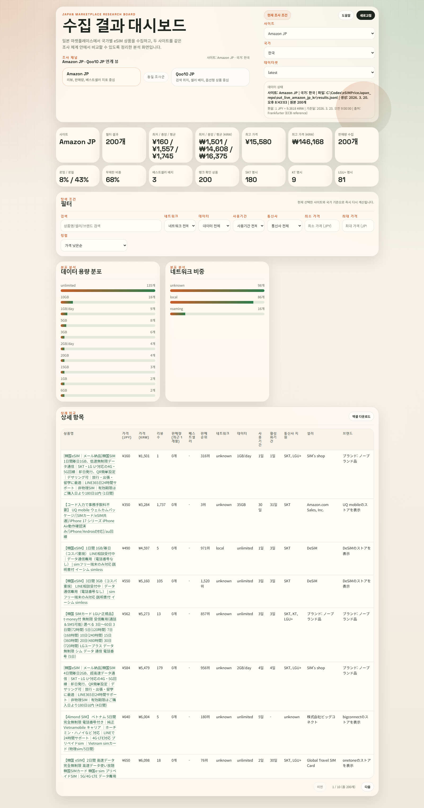

# eSIMPriceCollector_Japan

일본 마켓플레이스의 eSIM 상품을 국가별로 수집하고, 정규화된 결과를 CSV/JSONL과 대시보드로 비교하는 크롤러입니다.  
현재 `amazon_jp`, `qoo10_jp`를 지원하며, 국가 축은 `kr`, `vn`, `th`, `tw`, `hk`, `mo`, `us`를 사용합니다.

## Dashboard Preview

현재 대시보드 전체 화면:



## Design Note
- 실행 단위: `site + country + query`
- 크롤러 CLI: `python -m app crawl --site <site> --country <country> --limit <n> --out <dir>`
- 저장 단위: `dashboard/data/sites/<site>/<country>/latest.{jsonl,csv}`
- 대시보드 단위: `사이트 + 국가 + 데이터셋(latest/run)`
- 확장 방식: 사이트별 adapter 추가
- 레거시 호환: 기존 site-only `index.json`은 `kr` fallback으로 읽음

## Features
- Playwright 기반 Amazon JP / Qoo10 JP 검색 및 상세 수집
- 상위 N개 상품 수집 (`--limit`, 기본 50, 최대 200)
- 다중 selector + 텍스트 fallback 기반 휴리스틱 추출
- `evidence` 저장
- 실패 URL/에러/스크린샷 기록 (`failed.jsonl`)
- 출력 파일 생성
  `results.jsonl`, `results.csv`, `failed.jsonl`, `invalid.jsonl`, `invalid.csv`
- 대시보드 제공
  사이트/국가/데이터셋 선택, 필터, KPI, 정렬, 다운로드
- KRW 환산 가격 지원
  `price_jpy` 기준으로 `price_krw`를 계산해 표시

## Install
```powershell
python -m venv .venv
.\.venv\Scripts\Activate.ps1
pip install -r requirements.txt
pip install -r requirements-dev.txt
playwright install chromium
npm install
```

## Quick Start
기본 query는 `--country`에 맞춰 자동 선택됩니다.

```powershell
python -m app crawl --site amazon_jp --country kr --limit 50 --out .\out_amazon_kr
python -m app crawl --site amazon_jp --country vn --limit 50 --out .\out_amazon_vn
python -m app crawl --site qoo10_jp --country tw --limit 50 --out .\out_qoo10_tw
```

직접 query를 지정할 수도 있습니다.

```powershell
python -m app crawl --site qoo10_jp --country hk --query "eSIM 香港 5G" --limit 30 --out .\out_qoo10_hk_custom
```

스모크 실행:

```powershell
python -m app crawl --site amazon_jp --country kr --limit 5 --concurrency 2 --min-delay 1 --max-delay 2 --out .\out_smoke_amazon_kr
python -m app crawl --site qoo10_jp --country vn --limit 5 --concurrency 2 --min-delay 1 --max-delay 2 --out .\out_smoke_qoo10_vn
```

## Publish Workflow

### Publish Only
이미 생성된 `results.jsonl`, `results.csv`를 대시보드 데이터로 반영할 때 사용합니다.

```powershell
.\tools\publish.ps1 -OutDir .\out_amazon_vn -DataDir dashboard\data -Site amazon_jp -Country vn -Query "eSIM ベトナム" -Limit 50
```

### One-click
크롤링 후 정적 대시보드 데이터 반영, 커밋/푸시까지 한 번에 진행합니다.

```powershell
powershell -ExecutionPolicy Bypass -File .\tools\run_and_publish.ps1 -Site amazon_jp -Country kr -Limit 200 -OutDir .\out_auto_kr
powershell -ExecutionPolicy Bypass -File .\tools\run_and_publish.ps1 -Site amazon_jp -Country vn -Limit 100 -OutDir .\out_auto_vn
powershell -ExecutionPolicy Bypass -File .\tools\run_and_publish.ps1 -Site qoo10_jp -Country us -Limit 50 -OutDir .\out_auto_us
```

게시 후 생성 구조 예시:

```text
dashboard/data/
  index.json
  runs/
    20260320T090000Z_amazon_jp_vn_out_amazon_vn.csv
    20260320T090000Z_amazon_jp_vn_out_amazon_vn.jsonl
  sites/
    amazon_jp/
      vn/
        latest.csv
        latest.jsonl
        metadata.json
```

## Dashboard

실행:

```powershell
npm run dashboard
```

브라우저에서 `http://localhost:4173` 접속.

대시보드에서 제공하는 것:
- 사이트 선택: `Amazon JP`, `Qoo10 JP`
- 국가 선택: `한국`, `베트남`, `대만`, `홍콩`, `마카오`, `미국`
- 데이터셋 선택: 선택한 `site + country` 조합의 latest/run 목록
- 필터: 검색어, 네트워크, 데이터 용량, 사용기간, 통신사 지원, 가격 범위
- 정렬: 가격, 판매량, 리뷰, 검색 위치, 사용기간
- 다운로드: 현재 필터 결과 기준 상세항목 다운로드

KRW 환산 동작:
- `price_krw = Math.round(price_jpy * rate)`
- 환율은 Frankfurter 기준 `JPY/KRW`를 사용
- 로컬 서버 모드에서는 `/api/latest`와 `/api/export.xlsx`에 `price_krw`가 포함됨
- 정적 배포(GitHub Pages)에서는 브라우저가 환율을 조회하고, 다운로드 파일도 `price_krw`를 포함한 CSV로 생성함
- 환율 API 실패 시 최근 성공 환율 캐시를 재사용할 수 있음

주의:
- 태국(`th`)은 수집 대상이지만 현재 상단 국가 selector에는 노출하지 않음
- 새 스키마는 `carrier_support_local`을 우선 사용
- 한국(`kr`) 구형 데이터만 `carrier_support_kr` fallback 사용
- 비한국 구형 데이터는 제목/evidence 기반 경량 fallback으로 carrier 복원

## Output Files

기본 출력:
- `results.jsonl`
- `results.csv`
- `failed.jsonl`
- `invalid.jsonl`
- `invalid.csv`

핵심 필드:
- `site`, `country`, `site_product_id`
- `title`, `price_jpy`, `review_count`, `monthly_sold_count`, `is_bestseller`, `bestseller_rank`
- `validity`, `usage_validity`, `activation_validity`, `network_type`
- `carrier_support_local`
- `carrier_support_kr`
- `data_amount`, `product_url`, `asin`, `seller`, `brand`, `evidence`

예시 JSONL:

```json
{"site":"amazon_jp","country":"kr","title":"韓国 eSIM 7日 3GB","price_jpy":1980,"usage_validity":"7일","activation_validity":"30일","network_type":"roaming","carrier_support_local":{"skt":true,"kt":null,"lgu":null},"carrier_support_kr":{"skt":true,"kt":null,"lgu":null},"data_amount":"3GB","product_url":"https://www.amazon.co.jp/dp/B0ABCDEF12","asin":"B0ABCDEF12","site_product_id":"B0ABCDEF12","seller":"Example Store","brand":"Example"}
{"site":"qoo10_jp","country":"vn","title":"ベトナム eSIM 3日 unlimited","price_jpy":1080,"usage_validity":"3일","activation_validity":"90일","network_type":"unknown","carrier_support_local":{"viettel":true,"vinaphone":null,"mobifone":null,"vietnamobile":null},"carrier_support_kr":{"skt":null,"kt":null,"lgu":null},"data_amount":"unlimited","product_url":"https://www.qoo10.jp/item/ESIM/1133241666","asin":null,"site_product_id":"1133241666","seller":"Example Seller","brand":null}
```

## Tests
```powershell
python -m pytest -q
node --check dashboard_server.js
node --check dashboard\exchange-rate.js
node --check dashboard\app.js
```

`dashboard_server.js` 관련 테스트를 실행하려면 `npm install`로 `xlsx` 의존성이 설치되어 있어야 합니다.

## Adapter Extension Guide
1. `app/adapters/<site>.py` 생성 후 `MarketplaceAdapter` 구현
2. `search()`에서 URL/상품 식별자 스텁 반환
3. `fetch_detail()`에서 공통 모델 `ProductDetail` 로 매핑
4. 사이트별 selector는 다중 후보 + 텍스트 fallback 유지
5. `app/adapters/factory.py`에 사이트 등록

## Notes
- 캡차 우회, 계정 도용, 공격적 차단 회피는 구현하지 않음
- Amazon DOM 변경이 잦아서 단일 selector 의존을 피하고 휴리스틱 추출을 사용함
