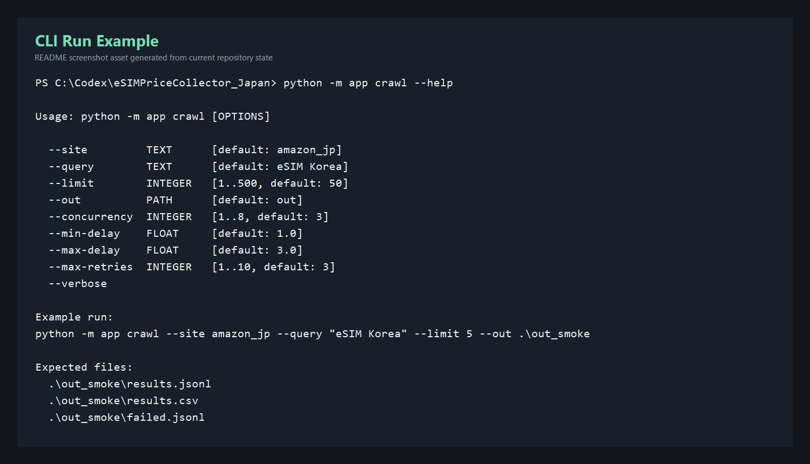
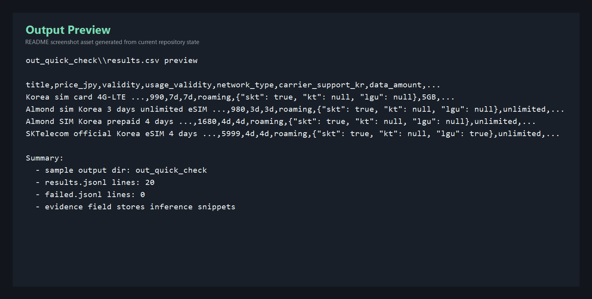
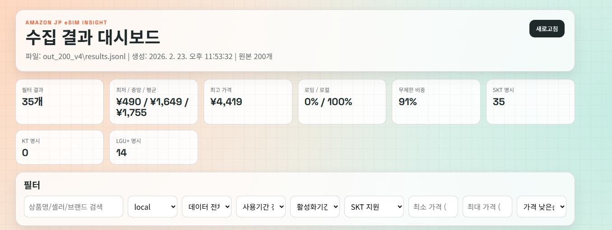
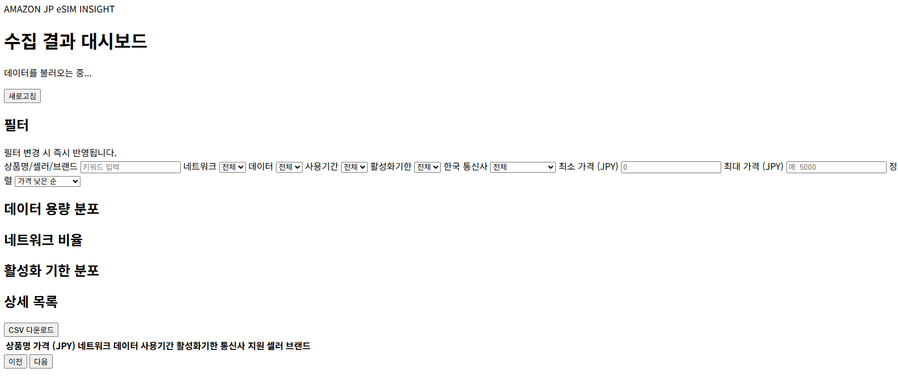

# eSIMPriceCollector_Japan

Amazon Japan(`amazon.co.jp`)에서 `eSIM Korea` 검색 결과를 수집하고, 분석용 정규화 데이터로 저장하는 크롤러입니다.  
현재는 `amazon_jp` 어댑터만 구현되어 있으며, 구조는 다른 마켓플레이스 어댑터를 추가할 수 있도록 분리되어 있습니다.

## 개요

### 설계 메모
- CLI 진입점: `python -m app crawl`
- 사이트별 수집기: `app/adapters/`
- 추론/정규화 로직: `app/extractors/heuristics.py`
- 크롤링 파이프라인: `app/pipeline/crawler.py`
- 결과 저장: `app/output/writers.py`
- 대시보드: `dashboard/`, `dashboard_server.js`

### 현재 지원 범위
- 지원 사이트: `amazon_jp`
- 렌더링 방식: Playwright + Chromium
- 기본 동작: 검색 결과 상위 N개 상품 상세 페이지 수집
- 출력 파일:
  - `results.jsonl`
  - `results.csv`
  - `failed.jsonl`
- 실패 시 `out/<run>/screenshots/` 아래에 스크린샷 저장

## 주요 기능
- Amazon JP 검색 결과에서 상품 URL/ASIN/검색 결과 메타 수집
- 상세 페이지에서 가격, 사용기간, 데이터 용량, 통신망 유형, 한국 통신사 지원 여부 추출
- 다중 셀렉터 + 텍스트 패턴 fallback 기반 추출
- 추론 결과에 대한 `evidence` 텍스트 저장
- 재시도, 랜덤 딜레이, 동시성 제어 지원
- CSV/JSONL 동시 저장
- 결과 CSV를 바로 확인할 수 있는 정적 대시보드 제공

## 설치

### Python 환경
```powershell
python -m venv .venv
.\.venv\Scripts\Activate.ps1
pip install -r requirements.txt
pip install -r requirements-dev.txt
playwright install chromium
```

### 대시보드용 Node.js 의존성
```powershell
npm install
```

## 실행 방법

### 기본 실행
```powershell
python -m app crawl --site amazon_jp --query "eSIM Korea" --limit 50 --out .\out
```

### Smoke 실행
`--limit 5` 기준으로 전체 흐름이 끝까지 동작하는지 빠르게 확인할 때 사용합니다.

```powershell
python -m app crawl --site amazon_jp --query "eSIM Korea" --limit 5 --concurrency 2 --min-delay 1 --max-delay 2 --out .\out_smoke
```

### CLI 옵션 확인
```powershell
python -m app crawl --help
```

## 실행 화면

### CLI 실행 예시


### 결과 파일 미리보기


## 출력 파일

크롤링이 끝나면 지정한 출력 디렉터리에 아래 파일이 생성됩니다.

- `results.jsonl`: 상품 1건당 1줄 JSON
- `results.csv`: 엑셀/분석용 CSV
- `failed.jsonl`: 실패 URL, 에러 타입, 메시지, 스크린샷 경로

예시:

```text
out_smoke/
├─ results.jsonl
├─ results.csv
├─ failed.jsonl
└─ screenshots/
```

## 결과 스키마

현재 프로그램이 저장하는 핵심 필드는 아래와 같습니다.

- `title`
- `price_jpy`
- `validity`
- `usage_validity`
- `network_type`
- `carrier_support_kr`
- `data_amount`
- `sales_last_month_min`
- `sales_last_month_text`
- `bestseller_badge`
- `bestseller_rank`
- `bestseller_category`
- `bestseller_rank_text`
- `product_url`
- `asin`
- `seller`
- `brand`
- `evidence`

### JSONL 예시
```json
{
  "title": "Korea eSIM 7일 3GB",
  "price_jpy": 1980,
  "validity": "7일",
  "usage_validity": "7일",
  "network_type": "roaming",
  "carrier_support_kr": {
    "skt": true,
    "kt": null,
    "lgu": null
  },
  "data_amount": "3GB",
  "sales_last_month_min": 500,
  "sales_last_month_text": "過去1か月で500点以上購入されました",
  "bestseller_badge": true,
  "bestseller_rank": 1234,
  "bestseller_category": "家電＆カメラ",
  "bestseller_rank_text": "売れ筋ランキング: 1,234位 家電＆カメラ",
  "product_url": "https://www.amazon.co.jp/dp/B0ABCDEF12",
  "asin": "B0ABCDEF12",
  "seller": "Example Store",
  "brand": "Example",
  "evidence": {
    "price_jpy": ["￥1,980"],
    "usage_validity": ["상품명 또는 상세 설명 일부"],
    "carrier_support_kr": ["SKT 관련 문구 일부"]
  }
}
```

## 추출 기준

### 가격
- `￥`, `¥`, `JPY` 패턴을 우선 인식해 정수 JPY로 변환합니다.
- 상세 페이지 가격이 없으면 검색 결과 가격으로 fallback 합니다.

### 사용기간
- `7日`, `30日間`, `有効期限`, `利用期間`, `validity` 등의 패턴을 기준으로 추출합니다.
- 현재 결과에는 `validity`와 `usage_validity`를 함께 저장합니다.

### 네트워크 유형
- `現地回線`, `ローカル`, `local` 포함 시 `local`
- `ローミング`, `国際ローミング`, `roaming` 포함 시 `roaming`
- 판단 불가 시 `unknown`

### 한국 통신사 지원
- `SKT`, `KT`, `LG U+`, `LGU+`, `Uplus` 키워드를 한국 사용 맥락과 함께 탐지합니다.
- 명확하지 않으면 `null`로 남기고 `evidence`만 저장합니다.

## 대시보드 보기

대시보드는 `dashboard/data/latest.csv`를 읽는 정적 페이지입니다.  
먼저 크롤링 결과를 `latest.csv`로 복사한 뒤 서버를 띄우면 됩니다.

### 1) 크롤링
```powershell
python -m app crawl --site amazon_jp --query "eSIM Korea" --limit 50 --out .\out
```

### 2) 최신 CSV 반영
```powershell
.\tools\publish.ps1 -OutDir .\out
```

### 3) 대시보드 실행
```powershell
npm run dashboard
```

브라우저에서 `http://localhost:4173`에 접속하면 됩니다.

### 대시보드 화면


### 웹 배포 화면 예시


## 테스트

```powershell
python -m pytest -q
```

현재 테스트에는 다음이 포함됩니다.

- 휴리스틱 추출 로직 테스트
- Fake adapter 기반 파이프라인 smoke 테스트

## 어댑터 확장 가이드

새 사이트를 추가할 때는 어댑터만 구현하는 방향으로 확장합니다.

1. `app/adapters/<site>.py` 파일 추가
2. `MarketplaceAdapter` 구현
3. `search()`에서 상품 스텁 목록 반환
4. `fetch_detail()`에서 `ProductDetail`로 정규화
5. `app/cli.py`에서 `--site` 분기 추가

예:
- `AmazonJPAdapter`
- `RakutenAdapter`

## 주의 사항

- CAPTCHA 우회, 계정 탈취, 불법적 anti-bot 우회는 구현하지 않습니다.
- Amazon DOM 구조가 자주 바뀌므로 셀렉터와 휴리스틱 유지보수가 필요합니다.
- 불확실한 값은 억지로 채우지 않고 `null` 또는 `unknown`과 `evidence`를 저장하는 방향을 사용합니다.
